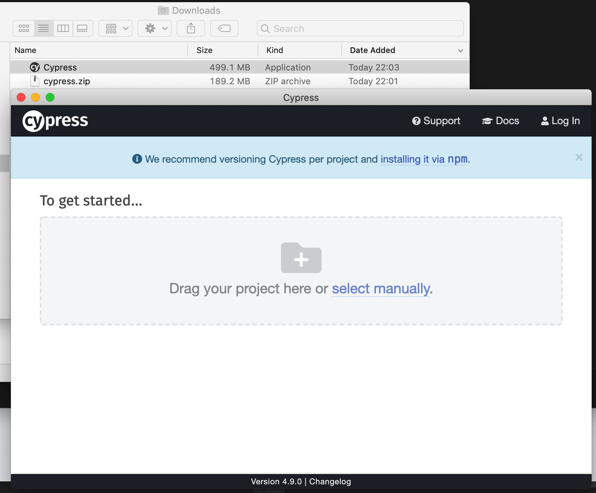
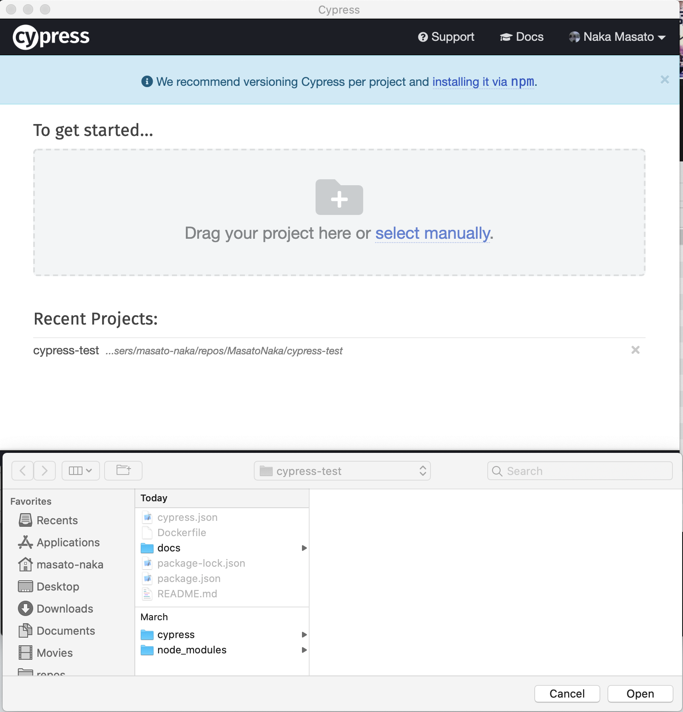
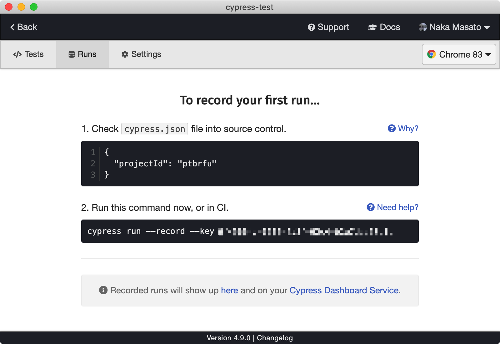
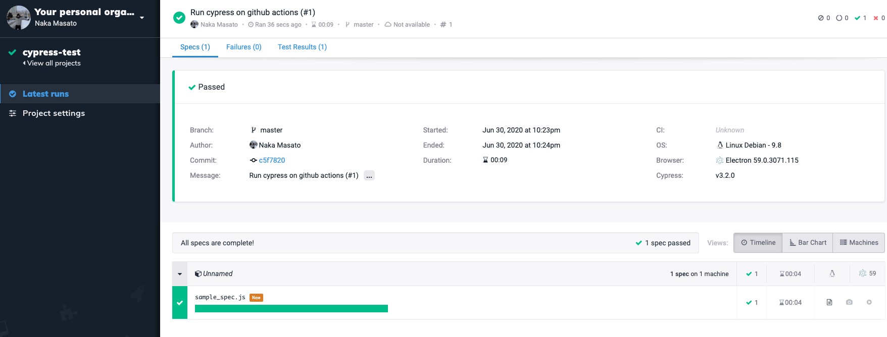

# cypress-test

## Version

- cypress 10.4.0

## Install Cypress

```
npm install cypress --save-dev
```

https://docs.cypress.io/guides/getting-started/installing-cypress.html#System-requirements


## Run

Run with UI:

```
./node_modules/.bin/cypress open
```

Run in terminal:

```
./node_modules/.bin/cypress run
```

## Run Cypress on Github Actions

https://github.com/cypress-io/github-action

## Set up Cypress Dashboard

1. Download app from (https://docs.cypress.io/guides/getting-started/installing-cypress.html#Direct-download).
    <details><summary>screenshot</summary>

    

    </details>
1. Sign in with your Github and Gmail account.
1. Set up.
    <details><summary>screenshot</summary>

    

    </details>
1. Get cypress record key.
    <details><summary>screenshot</summary>

    

    </details>
1. Run with Docker.

    ```
    docker run -it -e CYPRESS_RECORD_KEY=xxxxx -e CYPRESS_VIDEO=false -v $PWD:/e2e -w /e2e cypress/included:3.2.0 --record
    ```

    <details><summary>screenshot</summary>

    ```
    ± docker run -it -e CYPRESS_RECORD_KEY=xxxxx -e CYPRESS_VIDEO=false -v $PWD:/e2e -w /e2e cypress/included:3.2.0 --record
    This project has been configured to record runs on our Dashboard.

    It currently has the projectId: ptbrfu

    You also provided your Record Key, but you did not pass the --record flag.

    This run will not be recorded.

    If you meant to have this run recorded please additionally pass this flag.

    cypress run --record

    If you don't want to record these runs, you can silence this warning:

    cypress run --record false

    https://on.cypress.io/recording-project-runs

    ====================================================================================================

    (Run Starting)

    ┌────────────────────────────────────────────────────────────────────────────────────────────────┐
    │ Cypress:    3.2.0                                                                              │
    │ Browser:    Electron 59 (headless)                                                             │
    │ Specs:      1 found (sample_spec.js)                                                           │
    └────────────────────────────────────────────────────────────────────────────────────────────────┘


    ────────────────────────────────────────────────────────────────────────────────────────────────────

    Running: sample_spec.js...                                                               (1 of 1)
    Browserslist: caniuse-lite is outdated. Please run next command `npm update caniuse-lite browserslist`


    My First Test
        ✓ Visits the Kitchen Sink (1918ms)


    1 passing (4s)


    (Results)

    ┌──────────────────────────────┐
    │ Tests:        1              │
    │ Passing:      1              │
    │ Failing:      0              │
    │ Pending:      0              │
    │ Skipped:      0              │
    │ Screenshots:  0              │
    │ Video:        false          │
    │ Duration:     4 seconds      │
    │ Spec Ran:     sample_spec.js │
    └──────────────────────────────┘


    ====================================================================================================

    (Run Finished)


        Spec                                                Tests  Passing  Failing  Pending  Skipped
    ┌────────────────────────────────────────────────────────────────────────────────────────────────┐
    │ ✔ sample_spec.js                            00:04        1        1        -        -        - │
    └────────────────────────────────────────────────────────────────────────────────────────────────┘
        All specs passed!                           00:04        1        1        -        -        -
    ```

    </details>
1. Cypress dashboard.
    <details><summary>screenshot</summary>

    

    </details>

## Reference

- https://www.cypress.io/blog/2019/05/02/run-cypress-with-a-single-docker-command/
